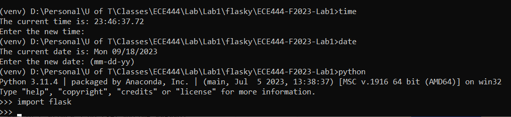

# ECE444 - Lab1: Flask Web Development

### Student Name: Yihang Lin
### Important Information: This repo is a clone of https://github.com/miguelgrinberg/flasky. 

## Activity 1: Installation

## Activity 2: Replay examples 2-1 and 2-2
#### Commits:

#### HTML Page:

## Activity 3: Replay and Modify Example in Chapter 3
#### Commit Message:

#### HTML Page:
