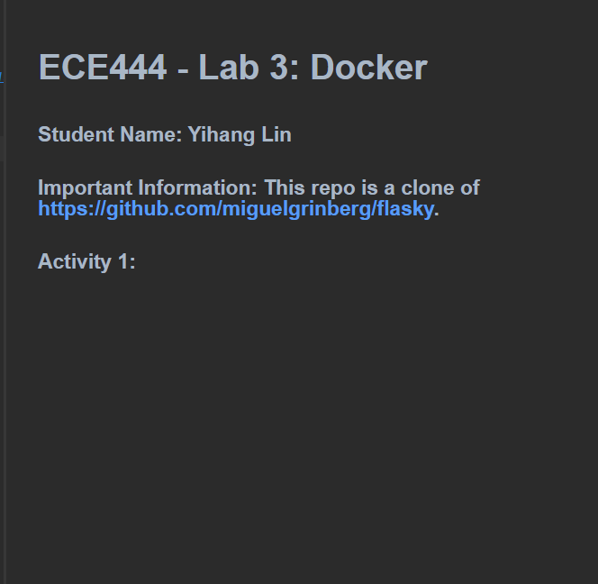
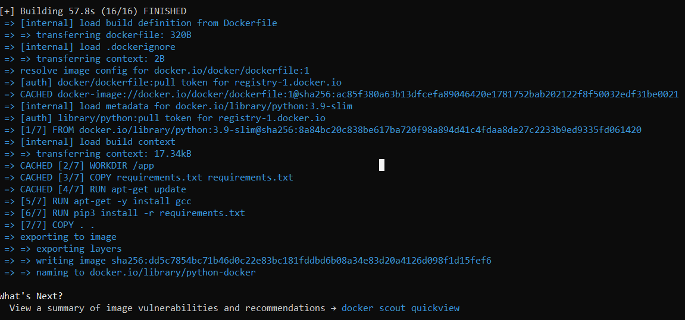
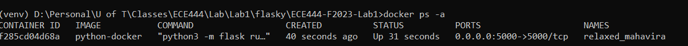
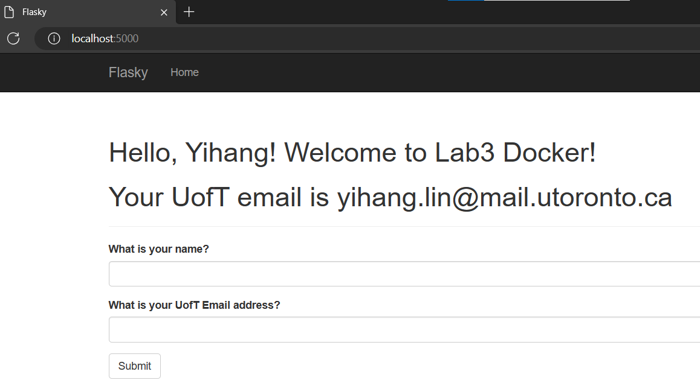

# ECE444 - Lab 3: Docker

### Student Name: Yihang Lin
### Important Information: This repo is a clone of https://github.com/miguelgrinberg/flasky. 

### Activity 1: 
#### Cleaned README.md

#### Changed default branch to "lab3" branch

### Activity 2: 
#### successfully installed docker

### Activity 3:
#### Application running locally

### Activity 4:
#### Successfully built docker image

#### Docker container running

#### Webpage at localhost:5000
